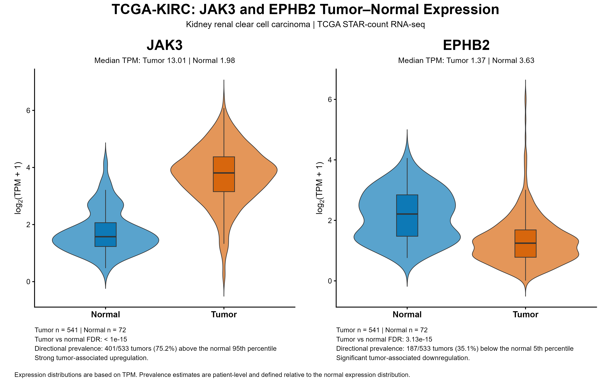

# TCGA-KIRC analysis of JAK3 and EPHB2

## Objective

This analysis evaluates the two priority kinase candidates, **JAK3** and **EPHB2**, in TCGA Kidney Renal Clear Cell Carcinoma (KIRC).

The analysis includes:

- tumor versus normal expression
- matched tumor-normal comparison
- prevalence of aberrant expression
- pathological stage association
- tumor grade association
- overall survival analysis

## Dataset

RNA-seq STAR-count data and clinical information were obtained from the NCI Genomic Data Commons.

After collapsing duplicate tumor aliquots to the patient level:

- 533 primary-tumor patients
- 72 solid-tissue normal samples
- 72 matched tumor-normal patients

Expression was evaluated using TPM and log2(TPM + 1) where appropriate.

---

# JAK3

## Tumor versus normal

JAK3 was strongly elevated in KIRC tumors.

- Tumor median TPM: 13.01
- Normal median TPM: 1.98
- 68/72 matched patients showed higher JAK3 expression in tumor

Using the normal 95th percentile as the high-expression threshold:

- 401/533 tumors were above the threshold
- prevalence of aberrantly high JAK3: **75.2%**

## Pathological stage

JAK3 expression increased with advancing pathological stage.

| Stage | N | Median TPM | High-expression prevalence |
|---|---:|---:|---:|
| Stage I | 233 | 11.79 | 70.8% |
| Stage II | 53 | 13.25 | 77.4% |
| Stage III | 102 | 13.41 | 77.5% |
| Stage IV | 56 | 17.83 | 85.7% |

Stage trend:

- Spearman rho = 0.209
- FDR = 1.72e-05

## Tumor grade

JAK3 also increased with tumor grade.

| Grade | N | Median TPM | High-expression prevalence |
|---|---:|---:|---:|
| G1 | 12 | 11.30 | 75.0% |
| G2 | 194 | 11.33 | 68.6% |
| G3 | 170 | 13.56 | 78.8% |
| G4 | 53 | 19.59 | 90.6% |

Grade trend:

- Spearman rho = 0.280
- FDR = 7.42e-09

## Overall survival

Higher continuous JAK3 expression was associated with poorer overall survival.

Multivariable Cox regression adjusting for age, sex, pathological stage and tumor grade:

- HR = 1.24
- 95% CI = 1.02-1.52
- FDR = 0.031

The proportional-hazards assumption was satisfied for JAK3 (P = 0.597).

The normal-derived high-JAK3 group also showed increased mortality risk:

- HR = 1.55
- FDR = 0.0456
- log-rank FDR = 0.0435

### Interpretation

JAK3 shows strong and frequent upregulation in KIRC. Its expression increases with pathological stage and tumor grade and remains associated with poorer overall survival after adjustment for major clinical variables.

These results support JAK3 as the stronger KIRC-associated candidate of the two kinases.

---

# EPHB2

## Tumor versus normal

EPHB2 showed the opposite tumor-normal pattern.

- Tumor median TPM: 1.35
- Normal median TPM: 3.63
- 54/72 matched patients showed lower EPHB2 expression in tumor

Because EPHB2 was downregulated, prevalence was defined using the normal 5th-percentile threshold.

- 187/533 tumors were below this threshold
- prevalence of aberrantly low EPHB2: **35.1%**

## Pathological stage

EPHB2 differed significantly among pathological stages:

- Kruskal-Wallis FDR = 0.0076

However, there was no significant monotonic Stage I-IV trend:

- Spearman rho = 0.066
- FDR = 0.162

Therefore, the data do not support a progressive decrease or increase in EPHB2 with advancing stage.

## Tumor grade

Within KIRC tumors, EPHB2 showed a modest positive association with grade.

| Grade | N | Median TPM |
|---|---:|---:|
| G1 | 12 | 0.95 |
| G2 | 194 | 1.18 |
| G3 | 170 | 1.36 |
| G4 | 53 | 1.57 |

Grade trend:

- Spearman rho = 0.148
- FDR = 0.0021

Thus, EPHB2 is lower in KIRC tumors than in normal kidney overall, while among tumors its expression modestly increases with increasing grade.

## Overall survival

Continuous EPHB2 expression was associated with survival in the adjusted Cox model:

- HR = 1.36
- 95% CI = 1.10-1.68
- FDR = 0.0081

However, the proportional-hazards assumption was violated for EPHB2:

- PH-assumption P = 0.014

Therefore, the EPHB2 hazard ratio should not be interpreted as a constant effect across the entire follow-up period.

The normal-derived low-EPHB2 group was not significantly associated with survival:

- HR = 0.78
- FDR = 0.120
- log-rank FDR = 0.119

### Interpretation

EPHB2 is significantly reduced in KIRC compared with normal kidney. Its relationship with disease progression is more complex than JAK3: there is no monotonic stage trend, while expression modestly increases with tumor grade.

The continuous survival association requires additional time-dependent assessment because the proportional-hazards assumption was violated.

---

# Overall KIRC conclusion

The TCGA-KIRC analysis distinguishes the two candidates.

**JAK3** shows a highly consistent disease-associated pattern:

- strong tumor upregulation
- high prevalence
- concordant matched-patient upregulation
- increasing expression with stage
- increasing expression with grade
- association with poorer overall survival after clinical adjustment

**EPHB2** shows a different pattern:

- tumor-associated downregulation
- aberrantly low expression in a subset of tumors
- no monotonic stage trend
- modest positive association with tumor grade
- a survival association that requires cautious interpretation because of non-proportional hazards

These findings describe cancer-context associations and do not establish a causal role for either kinase in KIRC.

---

# Figures

## Tumor versus normal expression

The distributions show the opposite tumor-associated patterns of the two priority genes: JAK3 is strongly elevated in KIRC tumors, whereas EPHB2 is significantly reduced relative to normal kidney tissue.
