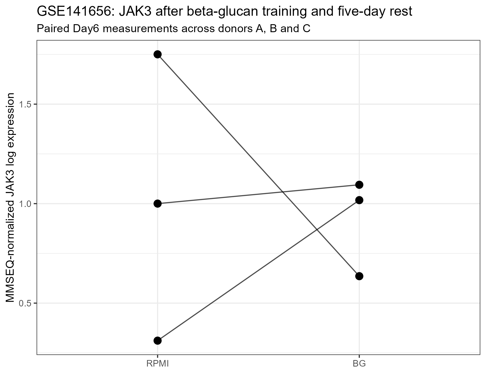
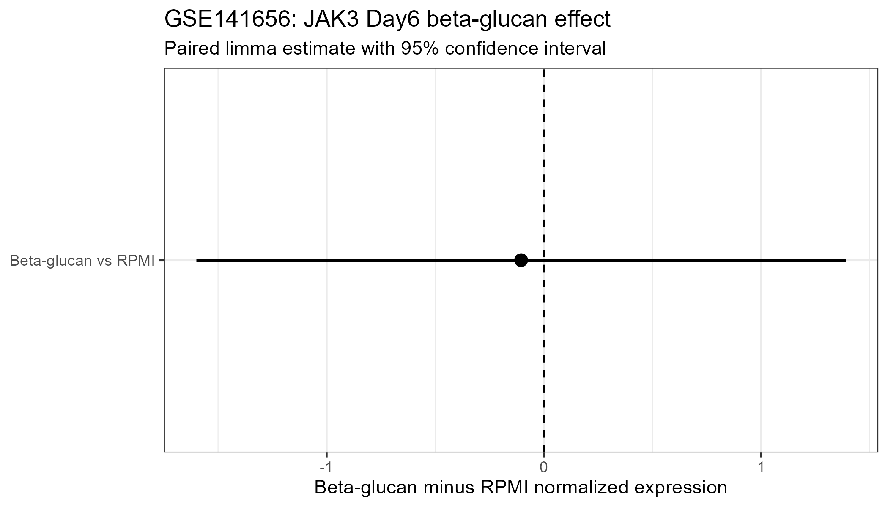

## Study design

GSE141656 profiled human monocytes trained with beta-glucan for 24 hours and then differentiated/rested for another five days.

At Day 6, trained and non-trained macrophages were profiled before and after Mycobacterium tuberculosis exposure.

For the primary JAK3 persistence analysis, only the non-Mtb Day6 samples were used.

## Primary comparison

Paired comparison within donors A, B and C:

- Day6 beta-glucan-trained macrophages
- Day6 RPMI control macrophages

The formal model was:

`~ donor + condition`

## Expression processing

Deposited gene-level MMSEQ outputs were jointly normalized using the MMSEQ `readmmseq()` workflow.

JAK3 Ensembl ID:

`ENSG00000105639`

Genes observed in at least 3 of 6 samples were retained for the genome-wide limma analysis.

## JAK3 result

Day6 beta-glucan vs Day6 RPMI:

- logFC: **-0.105**
- 95% CI: **-1.600 to 1.390**
- P value: **0.834**
- FDR: **0.940**

## Donor-wise effects

- Donor A: positive
- Donor B: negative
- Donor C: slightly positive

Direction consistency:

**2 of 3 donors in the same direction**

The mean effect was approximately zero.

## Interpretation

There was no evidence of persistent JAK3 deregulation after beta-glucan training in GSE141656.

The estimated effect was small, the confidence interval crossed zero, the FDR was non-significant, and the donor-level responses were heterogeneous.

## Paired expression

{width=90%}

## Effect size

{width=90%}

## Final classification

**No evidence of persistent JAK3 deregulation after beta-glucan training.**

## Cross-dataset relevance

This result indicates that persistent JAK3 alteration is not a universal feature of trained macrophages.

GSE141656 is retained as a negative independent validation dataset in the cross-study analysis.
