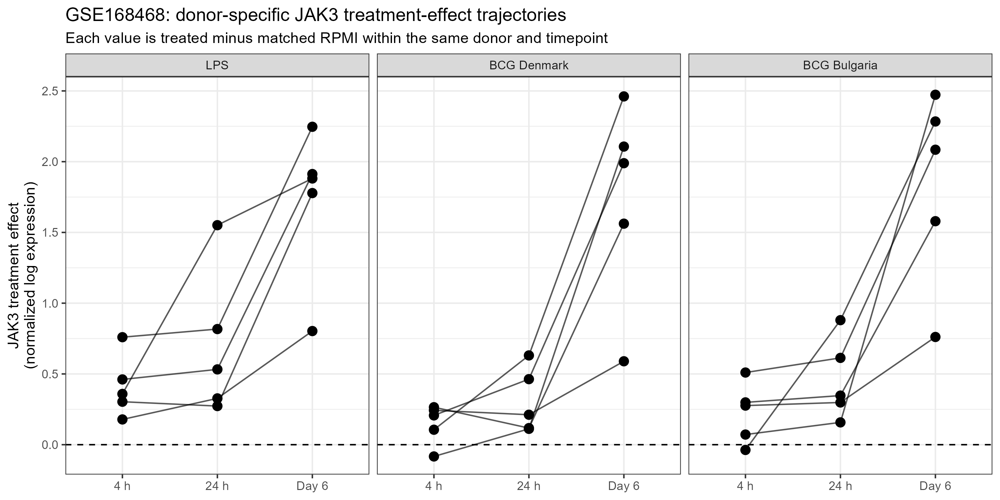
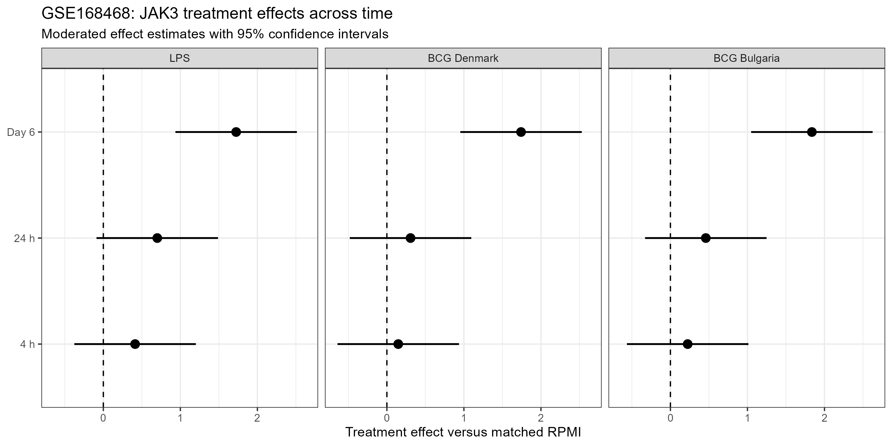

## Study design

GSE168468 is a time-resolved transcriptomic study of trained immunity in primary human monocytes.

Five donors were profiled.

The analyzed conditions were:

- RPMI control
- LPS
- BCG Denmark
- BCG Bulgaria

Samples were collected at:

- 4 hours
- 24 hours
- Day 6 after removal of the initial stimulus and macrophage differentiation

Day6 + 4 h LPS restimulation samples were excluded from the primary persistence analysis.

## Analysis strategy

Gene-level MMSEQ expression estimates were jointly normalized across the 60 primary trajectory samples using the MMSEQ `readmmseq()` workflow.

JAK3 was identified as:

`ENSG00000105639`

A donor-adjusted limma model was fitted across the retained gene universe.

The model tested:

- treatment versus matched RPMI at 4 h
- treatment versus matched RPMI at 24 h
- treatment versus matched RPMI at Day 6
- direct difference-of-differences trajectory contrasts

## Day6 post-washout JAK3 effects

| Stimulus | Effect | 95% CI | FDR | Donor consistency |
|---|---:|---:|---:|---:|
| LPS | 1.724 | 0.936 to 2.513 | 0.0177 | 5/5 positive |
| BCG Denmark | 1.742 | 0.953 to 2.530 | 0.0089 | 5/5 positive |
| BCG Bulgaria | 1.836 | 1.048 to 2.625 | 0.0029 | 5/5 positive |

### Interpretation

JAK3 shows a robust positive post-washout transcriptional response at Day 6.

The effect is observed after LPS and after both BCG vaccine strains, and all five donors show the same positive direction for each stimulus.

This provides strong independent evidence that persistent JAK3 transcriptional deregulation can occur after stimulus removal.

## Time-course trajectory

The mean JAK3 treatment effect increased across time:

### LPS

- 4 h: 0.412
- 24 h: 0.700
- Day 6: 1.724

### BCG Denmark

- 4 h: 0.147
- 24 h: 0.307
- Day 6: 1.742

### BCG Bulgaria

- 4 h: 0.224
- 24 h: 0.459
- Day 6: 1.836

## Direct trajectory tests

### Day6 versus 24 h

| Stimulus | Change in treatment effect | P value | Genome-wide FDR |
|---|---:|---:|---:|
| LPS | 1.024 | 0.0710 | 0.500 |
| BCG Denmark | 1.435 | 0.0129 | 0.598 |
| BCG Bulgaria | 1.377 | 0.0167 | 0.401 |

### Day6 versus 4 h

| Stimulus | Change in treatment effect | P value | Genome-wide FDR |
|---|---:|---:|---:|
| LPS | 1.312 | 0.0222 | 0.353 |
| BCG Denmark | 1.594 | 0.00609 | 0.473 |
| BCG Bulgaria | 1.612 | 0.00557 | 0.295 |

### Interpretation

The magnitude of the JAK3 treatment effect increases toward Day 6.

However, the direct trajectory contrasts do not remain significant after genome-wide multiple-testing correction.

Therefore, the data strongly support persistent Day6 JAK3 upregulation, while evidence for a statistically confirmed increase in trajectory magnitude should be considered suggestive rather than definitive.

## Donor-specific trajectories

{width=100%}

## Moderated treatment effects

{width=100%}

## Final classification

**GSE168468: strong positive independent post-washout JAK3 validation.**

The Day6 response is:

- positive across all three stimuli,
- concordant across all five donors,
- statistically supported after genome-wide multiple-testing correction.

The temporal pattern additionally suggests strengthening of the JAK3 response toward the post-washout state, although direct trajectory interactions are not FDR significant.

## Scope

This analysis demonstrates transcriptional persistence of JAK3.

It does not by itself establish that the persistent regulation is caused by an epigenetic mechanism.
