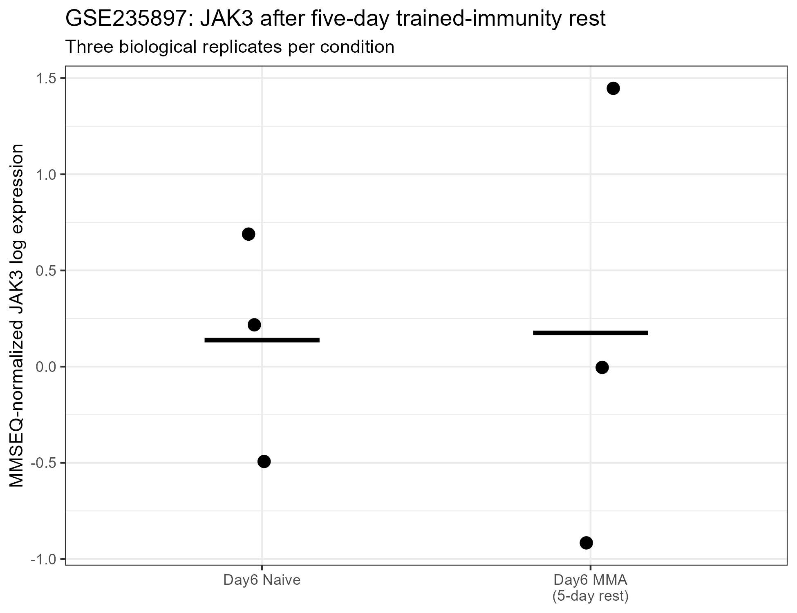
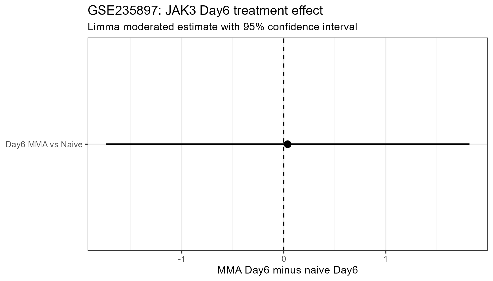

## Study design

GSE235897 profiled human monocyte-derived macrophages in a trained-immunity model.

Macrophages were exposed to the MMA training mixture for 24 hours and then rested for five days.

Three biological replicates were available for:

- Day 6 naive macrophages
- Day 6 MMA-trained macrophages

## Analysis

Deposited MMSEQ gene-level expression estimates were jointly normalized using the MMSEQ `readmmseq()` workflow.

JAK3 Ensembl ID:

`ENSG00000105639`

Because GEO does not explicitly identify replicate numbers as matched donors, the formal comparison was analyzed using an unpaired limma model.

## JAK3 Day 6 result

Day 6 MMA vs Day 6 naive:

- effect: **0.038**
- 95% CI: **-1.744 to 1.820**
- P value: **0.959**
- FDR: **0.9999**

## Replicate-level pattern

Descriptive replicate-index differences were:

- replicate 1: positive
- replicate 2: negative
- replicate 3: negative

Therefore, the direction was not consistent across replicates.

## Interpretation

GSE235897 does not provide evidence for persistent JAK3 transcriptional deregulation after MMA training and five days of rest.

The estimated effect was near zero, the confidence interval was wide and crossed zero, and there was no genome-wide statistical support.

## Expression visualization

{width=90%}

## Effect-size visualization

{width=90%}

## Final classification

**No evidence of persistent JAK3 deregulation after MMA training.**

This negative dataset is retained in the cross-dataset analysis to avoid selection based only on positive findings.

## Scope

The result indicates that persistent JAK3 deregulation is not observed in every trained-immunity model.

It does not exclude other persistent transcriptional or epigenetic changes induced by MMA.
