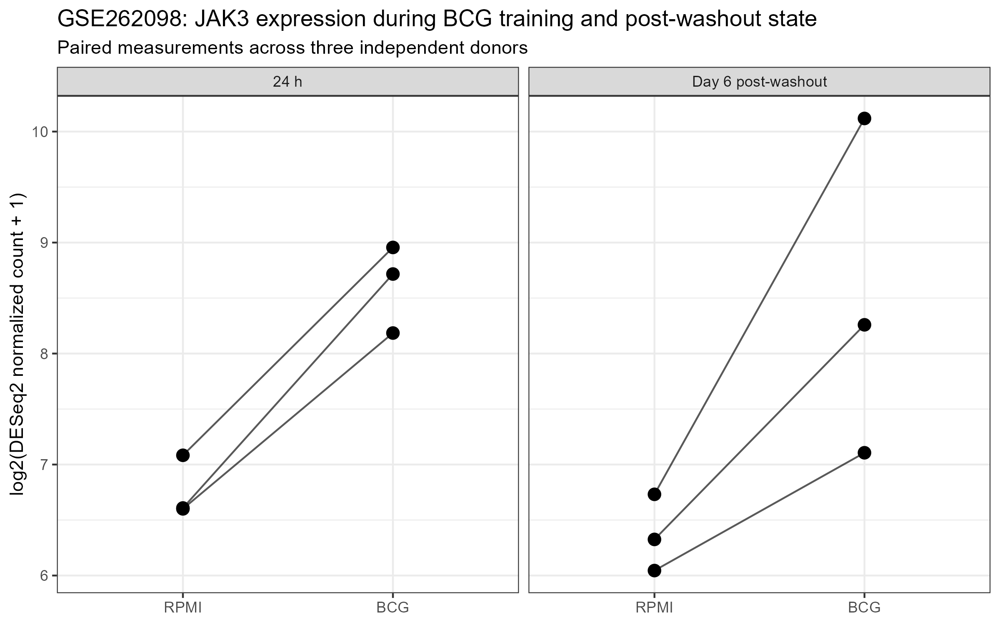
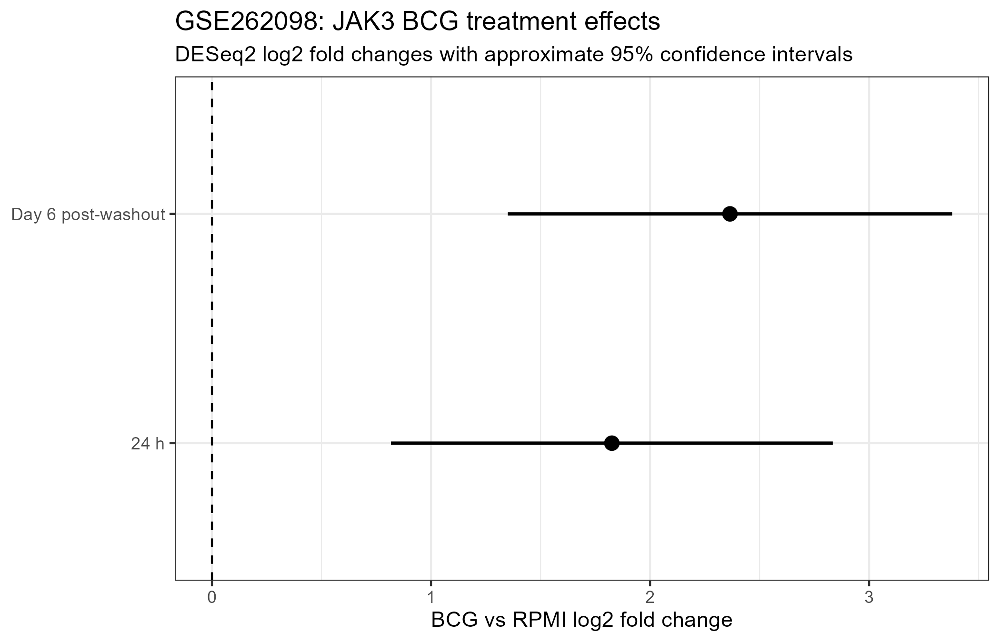

## Study design

GSE262098 profiled primary human monocytes from three independent donors during BCG-induced trained immunity.

Monocytes were exposed to BCG for 24 hours. The stimulus was then removed and cells were differentiated for an additional five days before the Day 6 measurement.

The primary comparisons analyzed here were:

- Day 1 BCG vs Day 1 RPMI
- Day 6 BCG vs Day 6 RPMI
- direct Day 6 vs Day 1 BCG-effect interaction

## Analysis

Deposited unnormalized HTSeq gene counts were analyzed using DESeq2.

The paired donor-aware model was:

`~ donor + time + condition + time:condition`

JAK3 Ensembl ID:

`ENSG00000105639`

## JAK3 results

| Contrast | log2FC | P value | FDR |
|---|---:|---:|---:|
| Day 1 BCG vs RPMI | 1.826 | 3.87e-4 | 0.00513 |
| Day 6 BCG vs RPMI | 2.365 | 4.85e-6 | 0.00191 |
| Day 6 vs Day 1 interaction | 0.539 | 0.460 | 0.818 |

## Donor consistency

All three donors showed positive JAK3 BCG effects at both time points.

### Day 1

- 3/3 donors positive

### Day 6

- 3/3 donors positive

## Interpretation

JAK3 is significantly increased after 24 hours of BCG exposure and remains significantly increased at Day 6 after stimulus removal.

This provides independent evidence for persistent positive JAK3 transcriptional deregulation after BCG exposure.

The Day 6 effect is numerically larger than the Day 1 effect, but the direct interaction test is not significant. Therefore, this dataset supports persistence but does not establish statistically significant strengthening of the JAK3 response between Day 1 and Day 6.

## Paired donor visualization

{width=95%}

## DESeq2 effect sizes

{width=90%}

## Final classification

**Strong positive persistent JAK3 validation after BCG washout.**

Evidence supporting this classification:

- significant Day 6 BCG-vs-RPMI effect;
- genome-wide FDR below 0.05;
- concordant positive direction in all three donors;
- direct donor-adjusted DESeq2 analysis of deposited raw gene counts.

## Scope

The result demonstrates persistent transcriptional deregulation of JAK3.

It does not by itself prove that persistence is caused by an epigenetic mechanism.
