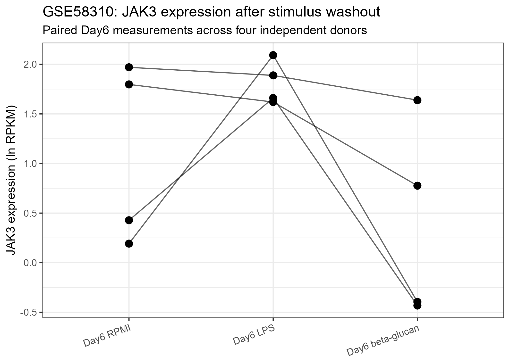

## Dataset

**GSE58310**: Epigenetic programming during monocyte-to-macrophage differentiation and trained innate immunity.

Human primary monocytes were incubated for 24 hours with:

- RPMI control
- LPS
- beta-glucan

The stimulus was then washed out and cells were cultured until Day 6.

Four independent buffy-coat donors were available for the RNA-seq comparison:

- BC8
- BC9
- BC11
- BC12

The primary late-state comparisons were:

- Day6 LPS vs Day6 RPMI
- Day6 beta-glucan vs Day6 RPMI

Day0 was retained only as contextual information and was not used as the primary persistence comparator.

## JAK3 analysis

JAK3 Ensembl ID:

`ENSG00000105639`

The processed GEO expression matrix was used as deposited.

Values are reported on the study's natural-log RPKM scale.

## Donor-level results

| Donor | Day6 RPMI | Day6 LPS | LPS − RPMI | Day6 beta-glucan | BG − RPMI |
|---|---:|---:|---:|---:|---:|
| BC8 | 0.192 | 2.092 | 1.900 | -0.395 | -0.588 |
| BC9 | 0.428 | 1.661 | 1.233 | -0.432 | -0.859 |
| BC11 | 1.797 | 1.620 | -0.177 | 0.776 | -1.021 |
| BC12 | 1.970 | 1.888 | -0.081 | 1.639 | -0.331 |

## LPS comparison

For Day6 LPS vs Day6 RPMI:

- mean paired effect: **+0.718 ln(RPKM)**
- 95% CI: **−0.900 to +2.337**
- paired t-test: **P = 0.253**
- Wilcoxon signed-rank: **P = 0.584**
- donor direction: **2 positive / 2 negative**

### Interpretation

The LPS-associated Day6 JAK3 response is **heterogeneous and uncertain** across donors.

The data do not support a consistent persistent JAK3 increase after LPS washout in this dataset.

## Beta-glucan comparison

For Day6 beta-glucan vs Day6 RPMI:

- mean paired effect: **−0.700 ln(RPKM)**
- 95% CI: **−1.183 to −0.216**
- paired t-test: **P = 0.019**
- Wilcoxon signed-rank: **P = 0.100**
- donor direction: **0 positive / 4 negative**

### Interpretation

All four donors show lower JAK3 expression after beta-glucan exposure and washout.

This is classified as a **consistent negative post-washout JAK3 shift**.

Because this is a targeted single-gene validation rather than a genome-wide differential-expression reanalysis, this result is interpreted using effect size, uncertainty, and donor-direction consistency rather than genome-wide FDR.

## Paired donor visualization

{width=90%}

## Cross-dataset classification

| Stimulus | Post-washout JAK3 classification |
|---|---|
| LPS | Heterogeneous / uncertain |
| beta-glucan | Consistent negative post-washout shift |

## Conclusion

GSE58310 provides independent evidence that post-washout JAK3 regulation is **not uniform across stimuli**.

LPS does not show a consistent persistent JAK3 response across donors, whereas beta-glucan produces a concordant negative Day6 shift in all four donors.

This supports the broader hypothesis that persistent JAK3 regulation may be stimulus-dependent rather than universal.
