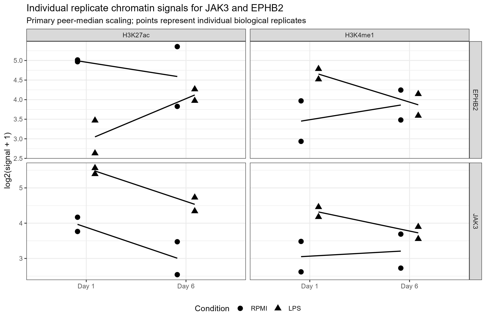
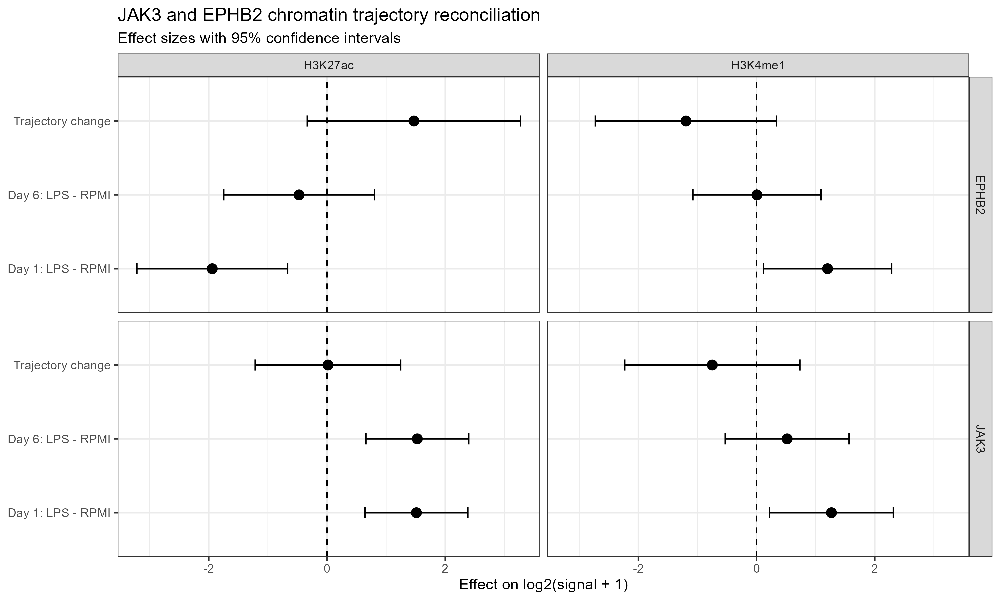

## Objective

This analysis addresses the chromatin-processing and trajectory concerns raised during review of the JAK3 and EPHB2 innate-memory analysis.

The reconciliation focuses on four points:

1. close the discovery audit and restrict interpretation to the prespecified JAK3/EPHB2 comparison;
2. show individual replicate evidence, effect sizes and uncertainty;
3. define **persistent** and **washout-emergent** explicitly;
4. test trajectory differences directly rather than inferring them from different significance labels at Day 1 and Day 6.

## Experimental comparison

The analysis compares LPS-treated and RPMI control samples at:

- **Day 1**: initial inflammatory stimulation;
- **Day 6**: post-washout state.

For each chromatin mark, the treatment effect was defined as:

$$
\mathrm{Treatment\ effect} =
\mathrm{LPS} - \mathrm{RPMI}
$$

The trajectory contrast was defined as:

$$
(\mathrm{LPS}_{d6}-\mathrm{RPMI}_{d6})
-
(\mathrm{LPS}_{d1}-\mathrm{RPMI}_{d1})
$$

This direct interaction contrast is used to assess whether the treatment response changes between Day 1 and Day 6.

## Chromatin processing reconciliation

Day-6 RPMI replicate 2 BigWig tracks were deposited as `NotNormalized`.

The local correction used normalized-peer genome-wide mean matching.

For H3K27ac:

- deposited RPMI replicate-2 global mean: **3.5739566**
- normalized-peer median: **4.1639120**
- primary scaling factor: **1.1650707**
- sensitivity scaling factor using RPMI replicate 1: **1.5208153**

For H3K4me1:

- deposited RPMI replicate-2 global mean: **3.1417254**
- normalized-peer median: **4.1651358**
- primary scaling factor: **1.3257479**
- sensitivity scaling factor using RPMI replicate 1: **1.6264455**

All promoter signals were transformed as:

$$
\log_2(\mathrm{signal}+1)
$$

The statistical model was fitted across the full set of **28,622 promoters**, followed by extraction of JAK3 and EPHB2.

## Operational definitions

### Persistent

A **persistent** response is defined as a treatment-associated effect that is retained at the post-washout time point.

Persistence is evaluated using:

- effect direction,
- effect magnitude,
- confidence intervals,
- and the direct trajectory contrast.

It is **not** inferred from significance labels alone.

### Washout-emergent

A **washout-emergent** response requires the post-washout treatment effect to become more positive than the earlier treatment effect.

Strong evidence requires support from the direct trajectory contrast:

$$
(\mathrm{Day\ 6\ effect})-(\mathrm{Day\ 1\ effect})
$$

rather than significance at one time point and non-significance at another.

## Individual replicate evidence

The plots below show the individual biological replicate signals used in the trajectory models. Day-6 RPMI replicate 2 uses the primary peer-median correction described above.

{width=100%}

## H3K27ac results

| Gene | Contrast | Effect | 95% CI | P value | Interpretation |
|---|---|---:|---|---:|---|
| JAK3 | Day 1 LPS − RPMI | 1.512 | 0.643 to 2.382 | 0.0050 | Positive |
| JAK3 | Day 6 LPS − RPMI | 1.528 | 0.658 to 2.398 | 0.0048 | Positive |
| JAK3 | Trajectory change | 0.015 | −1.215 to 1.245 | 0.977 | No evidence of change |
| EPHB2 | Day 1 LPS − RPMI | −1.942 | −3.217 to −0.667 | 0.0093 | Negative |
| EPHB2 | Day 6 LPS − RPMI | −0.472 | −1.748 to 0.803 | 0.404 | Near neutral |
| EPHB2 | Trajectory change | 1.470 | −0.334 to 3.273 | 0.094 | Upward shift, uncertain |

### Interpretation

**JAK3** shows a positive H3K27ac response at both Day 1 and Day 6. The estimated effects are nearly identical and the direct trajectory contrast is approximately zero. This supports a **persistent H3K27ac response**.

**EPHB2** shifts upward between Day 1 and Day 6, but the trajectory confidence interval includes zero. Therefore the H3K27ac data support a **candidate post-washout shift**, not a confirmed washout-emergent trajectory.

## H3K4me1 results

| Gene | Contrast | Effect | 95% CI | P value | Interpretation |
|---|---|---:|---|---:|---|
| JAK3 | Day 1 LPS − RPMI | 1.267 | 0.219 to 2.314 | 0.025 | Positive |
| JAK3 | Day 6 LPS − RPMI | 0.517 | −0.530 to 1.565 | 0.275 | Weaker/uncertain |
| JAK3 | Trajectory change | −0.749 | −2.231 to 0.733 | 0.265 | Attenuation uncertain |
| EPHB2 | Day 1 LPS − RPMI | 1.201 | 0.118 to 2.285 | 0.035 | Positive |
| EPHB2 | Day 6 LPS − RPMI | 0.005 | −1.078 to 1.089 | 0.991 | No clear effect |
| EPHB2 | Trajectory change | −1.196 | −2.728 to 0.336 | 0.105 | Downward shift, uncertain |

### Interpretation

H3K4me1 does not provide evidence for a post-washout EPHB2 emergence.

For JAK3, H3K4me1 is positive at Day 1 but weaker and uncertain by Day 6, indicating that persistence is **mark-specific rather than uniform across all chromatin layers**.

## ATAC supporting evidence

ATAC-seq was evaluated as a descriptive supporting layer.

The four processed ATAC tracks contained one sample per state, so replicate-level inferential statistics were not applied.

The promoter-level accessibility pattern was:

- **JAK3:** positive LPS-associated accessibility at both Day 1 and Day 6;
- **EPHB2:** a larger positive accessibility difference at Day 6 than Day 1.

These ATAC observations are treated as supportive and descriptive rather than proof of different trajectories.

## Integrated reconciliation

{width=100%}

The integrated interpretation is:

| Gene | Final interpretation |
|---|---|
| **JAK3** | Persistent H3K27ac response; H3K4me1 persistence is weaker |
| **EPHB2** | Candidate post-washout H3K27ac shift, but not confirmed washout-emergent chromatin |

## Conclusion

The reanalysis resolves the trajectory issue by testing Day 1 versus Day 6 treatment effects directly.

**JAK3 remains supported as a persistent chromatin-response candidate**, particularly at H3K27ac.

For **EPHB2**, the previous washout-emergent label should be softened. H3K27ac shows an upward post-washout shift, but the direct trajectory contrast remains uncertain and H3K4me1 does not show corresponding emergence.

Therefore, different significance labels at Day 1 and Day 6 are not used as evidence of distinct chromatin trajectories.
