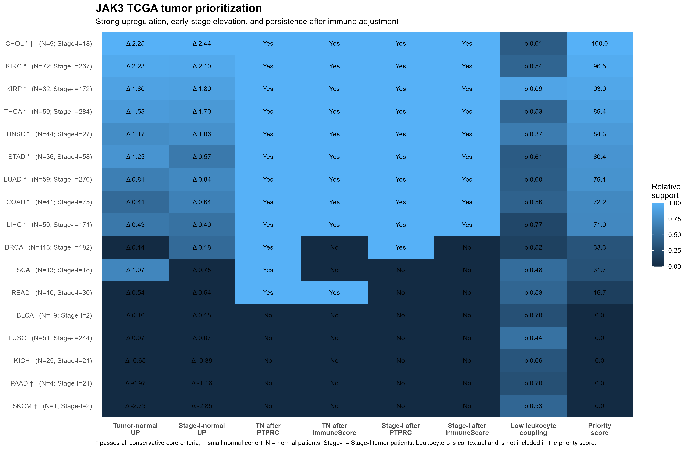

```{r}
tn <- read.csv(
  "tables/JAK3_complete_tumor_normal.csv",
  check.names = FALSE
)

matched <- read.csv(
  "tables/JAK3_complete_matched_tumor_normal.csv",
  check.names = FALSE
)

early <- read.csv(
  "tables/JAK3_complete_stageI_vs_normal.csv",
  check.names = FALSE
)

prev <- read.csv(
  "tables/JAK3_complete_aberrant_prevalence_P95.csv",
  check.names = FALSE
)

stage <- read.csv(
  "tables/JAK3_stage_statistics_complete.csv",
  check.names = FALSE
)

grade <- read.csv(
  "tables/JAK3_grade_statistics_complete.csv",
  check.names = FALSE
)

surv <- read.csv(
  "tables/JAK3_TCGA_CDR_survival_complete.csv",
  check.names = FALSE
)

lf <- read.csv(
  "tables/JAK3_PanImmune_leukocyte_correlations.csv",
  check.names = FALSE
)

cib <- read.csv(
  "tables/JAK3_CIBERSORT_robustness_by_cancer.csv",
  check.names = FALSE
)

imm <- read.csv(
  "tables/JAK3_pan_cancer_immune_adjusted_models.csv",
  check.names = FALSE
)

master <- read.csv(
  "tables/JAK3_master_pan_cancer_summary.csv",
  check.names = FALSE
)

flags <- read.csv(
  "tables/JAK3_master_key_flags_corrected.csv",
  check.names = FALSE
)
```

## Analysis scope

JAK3 was evaluated across all **33 TCGA cancer projects**.

Individual analyses were performed only where the required tumor,
normal, clinical, survival, or immune-infiltration data were available.

```{r}
scope <- data.frame(
  Analysis = c(
    "Tumor versus normal",
    "Matched tumor-normal",
    "Stage-I tumor versus normal",
    "Stage monotonic trend",
    "Grade monotonic trend",
    "Significant survival association",
    "Significant JAK3-leukocyte correlation",
    "Cancer types with >=1 strongest CIBERSORT signal"
  ),
  Number_of_cancers = c(
    nrow(tn),
    nrow(matched),
    nrow(early),
    sum(master$Stage_trend_FDR < 0.05, na.rm = TRUE),
    sum(master$Grade_trend_FDR < 0.05, na.rm = TRUE),
    sum(master$Survival_Cox_FDR < 0.05, na.rm = TRUE),
    sum(master$LF_Spearman_FDR < 0.05, na.rm = TRUE),
    sum(master$CIBERSORT_strongest_signals > 0, na.rm = TRUE)
  )
)

knitr::kable(
  scope,
  align = c("l", "r")
)
```

## JAK3 tumor prioritization

To facilitate rapid identification of tumor types with the most compelling
JAK3 signal, an integrated descriptive ranking was generated using three
equally weighted criteria:

1. strength of significant tumor-versus-normal upregulation,
2. strength of significant Stage-I-versus-normal upregulation, and
3. persistence of the positive association after immune-content adjustment.

Immune robustness was assessed using both **PTPRC/CD45** and the
**10-marker ImmuneScore** in the tumor-normal and Stage-I comparisons.
The priority score is a descriptive prioritization metric rather than an
additional statistical test.

```{r}
priority <- read.csv(
  "tables/JAK3_tumor_priority_ranking.csv",
  check.names = FALSE
)

priority_avail <- read.csv(
  "tables/JAK3_complete_33cancer_analysis_availability.csv",
  check.names = FALSE
)

priority_show <- merge(
  priority,
  priority_avail[
    ,
    c(
      "project",
      "Normal_patients",
      "Stage_I_patients",
      "Small_normal_n"
    )
  ],
  by = "project",
  all.x = TRUE,
  sort = FALSE
)

priority_show <- priority_show[
  order(priority_show$Priority_rank),
]

priority_show$Core <- ifelse(
  priority_show$Core_candidate,
  "Yes",
  "No"
)

priority_show$Small_normal_warning <- ifelse(
  priority_show$Small_normal_n,
  "Yes",
  "No"
)

priority_table <- priority_show[
  seq_len(min(10, nrow(priority_show))),
  c(
    "Priority_rank",
    "Cancer",
    "Priority_score",
    "TN_median_log2TPM1_difference",
    "StageI_median_log2TPM1_difference",
    "Immune_robustness",
    "LF_Spearman_rho",
    "Normal_patients",
    "Stage_I_patients",
    "Core",
    "Small_normal_warning"
  )
]

names(priority_table) <- c(
  "Rank",
  "Cancer",
  "Priority score",
  "Tumor-normal Δ",
  "Stage-I-normal Δ",
  "Immune robustness",
  "Leukocyte rho",
  "Normal n",
  "Stage-I n",
  "Core candidate",
  "Small normal n"
)

knitr::kable(
  priority_table,
  digits = 2
)
```

The heatmap below summarizes the same prioritization visually. Asterisks denote
tumor types passing all conservative core criteria, while the dagger symbol
marks small normal cohorts. Leukocyte-fraction correlation is shown as
context and is not included in the priority score.

{#fig-jak3-priority width=100%}

The ranking should be interpreted together with cohort size and data
availability. Strong effects from small normal cohorts should be treated
cautiously. Persistence after immune adjustment indicates that the association
is not fully explained by the measured immune proxies; it does not establish
malignant-cell-intrinsic expression.

[Download the complete JAK3 tumor-priority ranking](tables/JAK3_tumor_priority_ranking.csv)

## Tumor versus normal expression

Primary tumors were compared with Solid Tissue Normal samples where
normal tissue was available.

```{r}
tn_show <- tn[
  order(
    tn$Wilcoxon_FDR,
    -abs(tn$Median_log2TPM1_difference)
  ),
  c(
    "project",
    "tumor_n",
    "normal_n",
    "tumor_median_TPM",
    "normal_median_TPM",
    "Median_log2TPM1_difference",
    "Direction",
    "Wilcoxon_FDR",
    "Small_normal_n"
  )
]

knitr::kable(
  tn_show,
  digits = 4
)
```

## Matched tumor-normal expression

Where paired tumor and normal samples from the same patient were
available, paired analysis was performed.

```{r}
matched_show <- matched[
  order(matched$Paired_Wilcoxon_FDR),
  c(
    "project",
    "matched_pairs",
    "median_log2_difference",
    "tumor_higher_n",
    "tumor_lower_or_equal_n",
    "Paired_Wilcoxon_FDR",
    "Small_matched_n"
  )
]

knitr::kable(
  matched_show,
  digits = 4
)
```
## Early-stage tumor versus normal

Early-stage analysis used AJCC Stage I classifications, including
Stage IA, IB and IC where applicable.

```{r}
early_show <- early[
  order(
    early$Wilcoxon_FDR,
    -abs(early$Median_log2TPM1_difference)
  ),
  c(
    "project",
    "Stage_I_n",
    "normal_n",
    "Stage_I_median_TPM",
    "normal_median_TPM",
    "Median_log2TPM1_difference",
    "Direction",
    "Wilcoxon_FDR",
    "Small_stageI_n",
    "Small_normal_n"
  )
]

knitr::kable(
  early_show,
  digits = 4
)
```

## Prevalence of high or aberrant expression

Where normal tissue was available, the 95th percentile of normal-tissue
JAK3 TPM was used as the reference threshold for high or aberrant tumor
expression.

```{r}
prev_show <- prev[
  order(
    -prev$Aberrant_tumor_percent
  ),
  c(
    "project",
    "tumor_n",
    "normal_n",
    "Normal_P95_TPM",
    "Aberrant_tumor_n",
    "Aberrant_tumor_percent",
    "Small_normal_n"
  )
]

knitr::kable(
  prev_show,
  digits = 3
)
```
## Stage-wise expression trends

Stage analyses included both categorical stage differences and
monotonic stage-expression trends.

```{r}
stage_show <- stage[
  order(stage$Stage_trend_FDR),
  c(
    "project",
    "Patients_used",
    "Stage_groups_used",
    "Spearman_rho",
    "Kruskal_Wallis_FDR",
    "Stage_trend_FDR",
    "Sparse_groups_excluded"
  )
]

knitr::kable(
  stage_show,
  digits = 4
)
```

## Grade-wise expression trends

Grade analyses were performed only where sufficiently populated and
interpretable grade categories were available.

```{r}
grade_show <- grade[
  order(grade$Grade_trend_FDR),
  c(
    "project",
    "Patients_used",
    "Grade_groups_used",
    "Spearman_rho",
    "Kruskal_Wallis_FDR",
    "Grade_trend_FDR",
    "Sparse_valid_groups_excluded"
  )
]

knitr::kable(
  grade_show,
  digits = 4
)
```
## Survival analysis

Survival associations were evaluated as secondary evidence using
curated TCGA Clinical Data Resource endpoints.

Continuous JAK3 expression was modeled using Cox proportional-hazards
analysis.

```{r}
surv_show <- surv[
  order(surv$Cox_FDR),
  c(
    "project",
    "Endpoint",
    "N",
    "Events",
    "HR",
    "CI95_low",
    "CI95_high",
    "Cox_FDR",
    "PH_violation",
    "Low_event_n",
    "Analysis_status"
  )
]

knitr::kable(
  surv_show,
  digits = 4
)
```

## Immune and inflammatory infiltration controls

Because TCGA RNA-seq represents bulk tissue, several complementary
immune-infiltration controls were included.

These analyses assess how strongly observed JAK3 expression patterns
are associated with measured leukocyte or immune-cell content.

### Leukocyte fraction

```{r}
lf_show <- lf[
  order(lf$Spearman_FDR),
  c(
    "project",
    "N",
    "Median_leukocyte_fraction",
    "Spearman_rho",
    "Spearman_FDR",
    "R_squared_LF",
    "Low_N"
  )
]

knitr::kable(
  lf_show,
  digits = 4
)
```

### CIBERSORT immune-cell analysis

CIBERSORT analyses evaluated associations between JAK3 expression and
22 immune-cell fractions.

The robustness summary combines the primary quality-filtered analysis,
all-sample sensitivity analysis, and leukocyte-fraction-adjusted
models.

```{r}
cib_show <- cib[
  order(
    -cib$Strongest_signals,
    -cib$Robust_relative_signals
  ),
  c(
    "project",
    "Tested_cells",
    "Primary_significant",
    "Robust_relative_signals",
    "LF_adjusted_signals",
    "Strongest_signals"
  )
]

knitr::kable(
  cib_show
)
```
### PTPRC/CD45 and multi-marker immune adjustment

A complementary expression-based immune-control analysis used:

`PTPRC, CD3D, CD3E, MS4A1, CD79A, NKG7, LST1, TYROBP, FCER1G, CD68`

The multi-marker immune score was based on equal-weighted,
within-cancer standardized log2(TPM + 1) expression values.

```{r}
imm_show <- imm[
  imm$Adjustment != "Unadjusted",
  c(
    "project",
    "Comparison",
    "Adjustment",
    "Tumor_n",
    "Normal_n",
    "Coefficient",
    "Model_family_FDR",
    "Global_FDR",
    "Low_N"
  )
]

imm_show <- imm_show[
  order(
    imm_show$Comparison,
    imm_show$Adjustment,
    imm_show$Model_family_FDR
  ),
]

knitr::kable(
  imm_show,
  digits = 4
)
```

## Persistence after immune adjustment

Persistence was evaluated within the linear-model framework so that
unadjusted and adjusted associations were compared using the same model
family.

```{r}
persist_summary <- data.frame(
  Result = c(
    "Unadjusted tumor-normal OLS positive",
    "Tumor-normal positive after PTPRC adjustment",
    "Tumor-normal positive after ImmuneScore adjustment",
    "Tumor-normal positive association persisting after PTPRC",
    "Tumor-normal positive association persisting after ImmuneScore",
    "Unadjusted Stage-I OLS positive",
    "Stage-I positive after PTPRC adjustment",
    "Stage-I positive after ImmuneScore adjustment",
    "Stage-I positive association persisting after PTPRC",
    "Stage-I positive association persisting after ImmuneScore"
  ),
  Cancer_projects = c(
    sum(flags$TN_OLS_unadjusted_positive, na.rm = TRUE),
    sum(flags$TN_PTPRC_adjusted_positive, na.rm = TRUE),
    sum(flags$TN_ImmuneScore_adjusted_positive, na.rm = TRUE),
    sum(flags$TN_positive_persists_after_PTPRC, na.rm = TRUE),
    sum(flags$TN_positive_persists_after_ImmuneScore, na.rm = TRUE),
    sum(flags$StageI_OLS_unadjusted_positive, na.rm = TRUE),
    sum(flags$StageI_PTPRC_adjusted_positive, na.rm = TRUE),
    sum(flags$StageI_ImmuneScore_adjusted_positive, na.rm = TRUE),
    sum(flags$StageI_positive_persists_after_PTPRC, na.rm = TRUE),
    sum(flags$StageI_positive_persists_after_ImmuneScore, na.rm = TRUE)
  )
)

knitr::kable(
  persist_summary,
  align = c("l", "r")
)
```
## Integrated example: TCGA-KIRC

```{r}
kirc <- master[
  master$project == "TCGA-KIRC",
]

kirc_summary <- data.frame(
  Result = c(
    "Tumor-normal median log2(TPM+1) difference",
    "Tumor-normal FDR",
    "Matched median log2 difference",
    "Matched FDR",
    "Stage-I-normal median log2(TPM+1) difference",
    "Stage-I-normal FDR",
    "Stage Spearman rho",
    "Stage trend FDR",
    "Grade Spearman rho",
    "Grade trend FDR",
    "Survival HR",
    "Survival FDR",
    "Leukocyte-fraction Spearman rho",
    "Leukocyte-fraction FDR",
    "CIBERSORT strongest signals",
    "Tumor-normal PTPRC-adjusted coefficient",
    "Tumor-normal ImmuneScore-adjusted coefficient",
    "Stage-I PTPRC-adjusted coefficient",
    "Stage-I ImmuneScore-adjusted coefficient"
  ),
  Value = c(
    kirc$TN_median_log2TPM1_difference,
    kirc$TN_FDR,
    kirc$Matched_median_log2_difference,
    kirc$Matched_FDR,
    kirc$StageI_median_log2TPM1_difference,
    kirc$StageI_FDR,
    kirc$Stage_Spearman_rho,
    kirc$Stage_trend_FDR,
    kirc$Grade_Spearman_rho,
    kirc$Grade_trend_FDR,
    kirc$Survival_HR,
    kirc$Survival_Cox_FDR,
    kirc$LF_Spearman_rho,
    kirc$LF_Spearman_FDR,
    kirc$CIBERSORT_strongest_signals,
    kirc$IA_TN_PTPRC_Coefficient,
    kirc$IA_TN_ImmuneScore_Coefficient,
    kirc$IA_StageI_PTPRC_Coefficient,
    kirc$IA_StageI_ImmuneScore_Coefficient
  )
)

knitr::kable(
  kirc_summary,
  digits = 5
)
```

In TCGA-KIRC bulk RNA-seq, JAK3 is elevated in tumors, including
Stage-I tumors, relative to normal kidney tissue.

JAK3 expression is also strongly associated with measured immune
infiltration.

Positive tumor-normal and Stage-I-normal associations remain after
adjustment for PTPRC/CD45 and the broader immune-expression score.

These residual associations are not interpreted as proof of
malignant-cell-intrinsic JAK3 expression.

## Integrated 33-cancer summary

The table below combines the major analytical layers across all TCGA
projects.

```{r}
master_show <- master[
  ,
  c(
    "project",
    "TN_median_log2TPM1_difference",
    "TN_FDR",
    "Matched_median_log2_difference",
    "Matched_FDR",
    "StageI_median_log2TPM1_difference",
    "StageI_FDR",
    "Stage_Spearman_rho",
    "Stage_trend_FDR",
    "Grade_Spearman_rho",
    "Grade_trend_FDR",
    "Survival_HR",
    "Survival_Cox_FDR",
    "LF_Spearman_rho",
    "LF_Spearman_FDR",
    "CIBERSORT_strongest_signals"
  )
]

knitr::kable(
  master_show,
  digits = 4
)
```

## Limitations

Not every analytical module was available for every TCGA cancer type.

Important limitations include:

- absence or small numbers of normal samples in selected projects
- limited matched tumor-normal pairs for some cancers
- incomplete or heterogeneous stage annotation
- incomplete or heterogeneous grade annotation
- low survival event counts in selected cancers
- TCGA RNA-seq represents bulk tissue
- immune-adjusted residual associations do not prove malignant-cell-
  intrinsic expression
- early-stage associations are cross-sectional and do not establish
  a causal role in tumor initiation

## Download canonical results

- [Integrated 33-cancer master table](tables/JAK3_master_pan_cancer_summary.csv)
- [Corrected statistical flags](tables/JAK3_master_key_flags_corrected.csv)
- [Analysis availability](tables/JAK3_complete_33cancer_analysis_availability.csv)
- [Tumor-normal results](tables/JAK3_complete_tumor_normal.csv)
- [Matched tumor-normal results](tables/JAK3_complete_matched_tumor_normal.csv)
- [Stage-I-normal results](tables/JAK3_complete_stageI_vs_normal.csv)
- [Aberrant-expression prevalence](tables/JAK3_complete_aberrant_prevalence_P95.csv)
- [Stage statistics](tables/JAK3_stage_statistics_complete.csv)
- [Grade statistics](tables/JAK3_grade_statistics_complete.csv)
- [Survival results](tables/JAK3_TCGA_CDR_survival_complete.csv)
- [Leukocyte-fraction results](tables/JAK3_PanImmune_leukocyte_correlations.csv)
- [CIBERSORT robustness](tables/JAK3_CIBERSORT_robustness_by_cancer.csv)
- [Immune-adjusted models](tables/JAK3_pan_cancer_immune_adjusted_models.csv)
- [Integrity hashes](tables/SHA256SUMS.txt)
