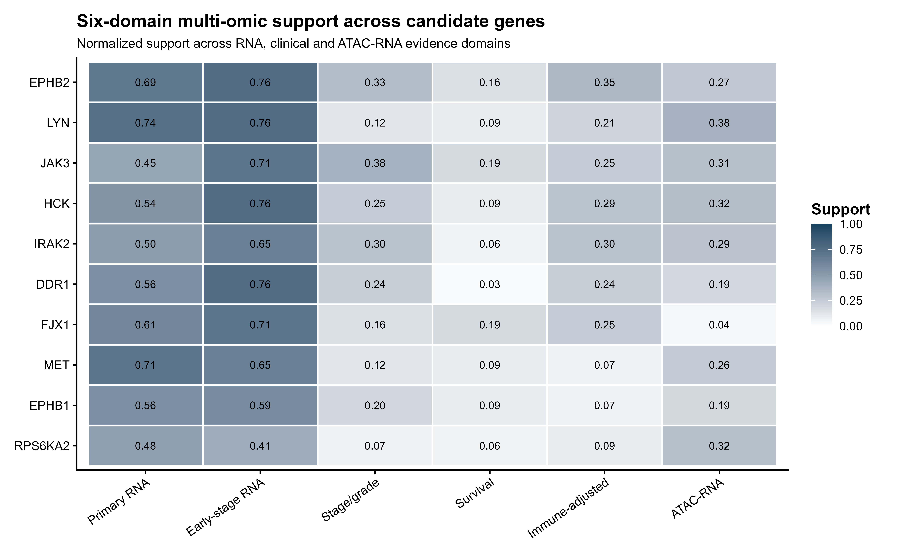
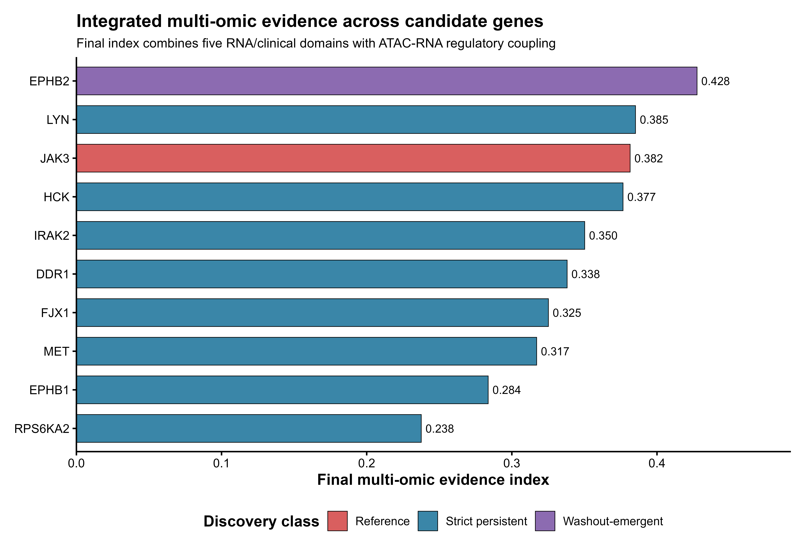
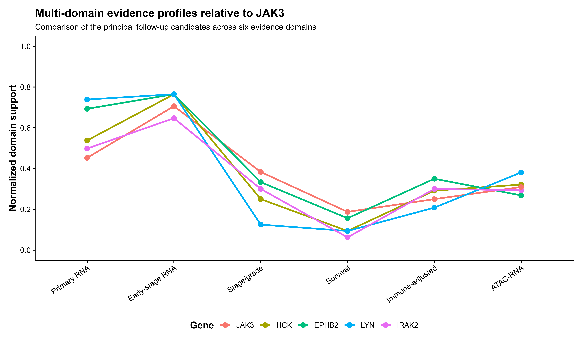
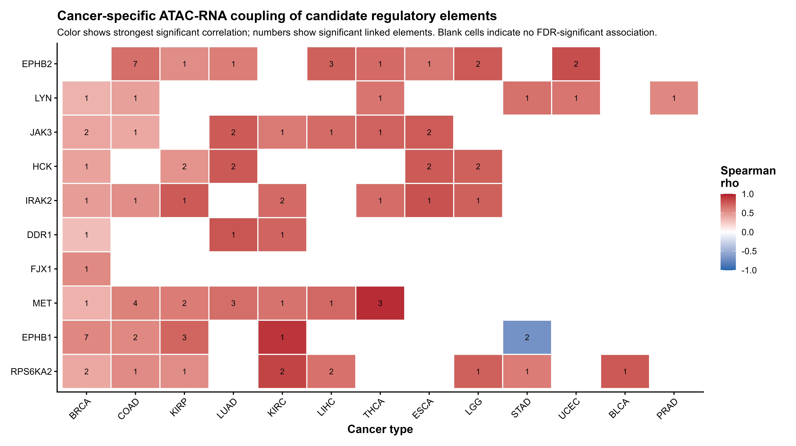
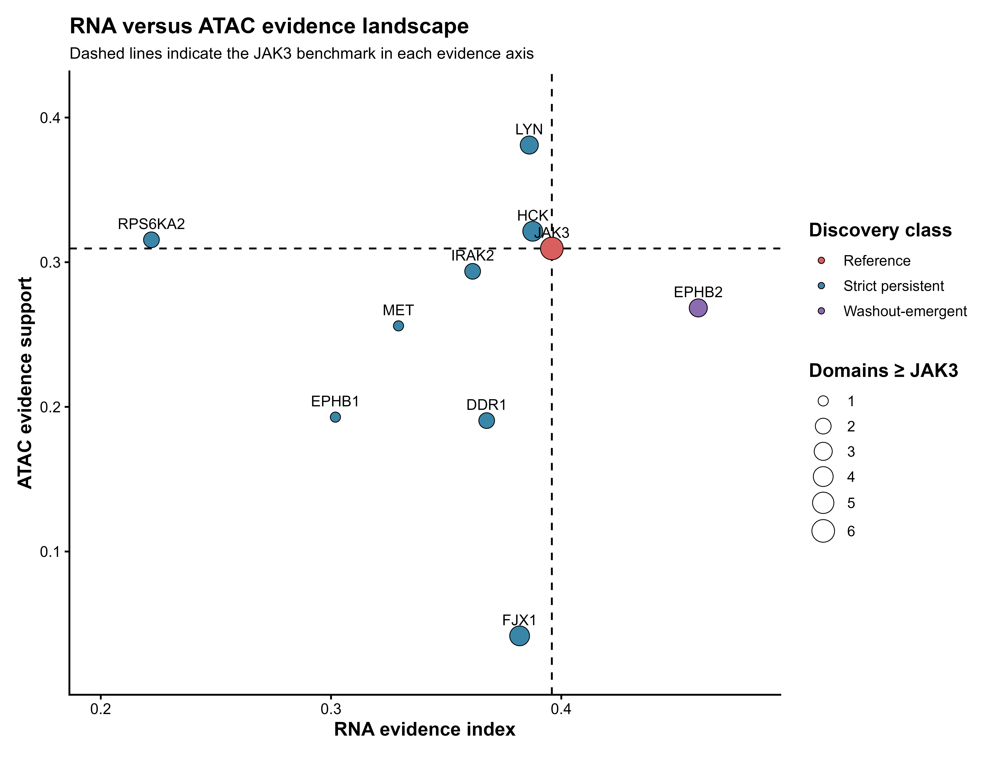

## Analysis objective

The completed **JAK3** analysis was used as the reference framework for an expanded panel:

`JAK3, MET, HCK, LYN, DDR1, IRAK2, FJX1, EPHB1, RPS6KA2, EPHB2`

The final comparison integrates six evidence domains:

1. Primary tumor RNA
2. Early-stage tumor RNA
3. Stage/grade progression
4. Survival
5. Immune-adjusted progression
6. Patient-matched ATAC-RNA regulatory coupling

The integrated scores are descriptive evidence summaries rather than formal probabilities or mechanistic rankings.

## Final biological follow-up

| Group | Genes |
|---|---|
| Reference | **JAK3** |
| Primary follow-up | **EPHB2, LYN, HCK, IRAK2** |
| Secondary follow-up | **DDR1, RPS6KA2** |
| Contextual / lower priority | **MET, EPHB1** |
| Separate scope check | **FJX1** |

[Download the complete candidate-priority table](tables/15_final_candidate_priority_table.csv)

## Six-domain multi-omic evidence

{width=100%}

The candidate genes show distinct evidence profiles rather than one uniform pattern.

## Integrated multi-omic evidence

{width=100%}

**EPHB2** showed the highest final multi-omic evidence index.

**HCK** showed one of the most JAK3-like balanced profiles.

**LYN** combined substantial RNA evidence with particularly strong normalized ATAC-RNA support.

**IRAK2** showed balanced RNA, immune-adjusted and regulatory evidence.

## Candidate profiles relative to JAK3

{width=100%}

The principal candidates are supported by different combinations of evidence:

- **EPHB2:** strongest overall integrated signal
- **HCK:** balanced profile close to JAK3
- **LYN:** strongest normalized ATAC-RNA evidence
- **IRAK2:** balanced multi-layer support

## TCGA ATAC regulatory analysis

Official TCGA pan-cancer ATAC Data S7 peak-to-gene links were used.

Across the ten genes, **51 official linked regulatory elements** were identified.

Some elements represented single fixed-width ATAC peaks, while broader enhancer units contained multiple constituent peaks.

The official `Summits` field was therefore used to map the regulatory units to the normalized TCGA ATAC matrix.

All **74 constituent summits mapped successfully**, preserving all **51 official regulatory elements**.

JAK3 retained its original simple structure of three linked regulatory elements corresponding to three individual ATAC peaks.

## Patient-matched ATAC-RNA analysis

ATAC accessibility was matched to RNA expression from the same TCGA patients.

RNA expression was summarized at patient level using mean TPM followed by `log2(TPM + 1)` transformation.

Spearman correlations were calculated independently for each gene-cancer-regulatory-element combination.

Analyses were classified as:

- **Primary:** at least 10 matched patients
- **Exploratory low N:** 5-9 matched patients
- **Not tested:** fewer than 5 matched patients

Benjamini-Hochberg FDR correction was applied to primary tests.

The expanded analysis reproduced the previously completed JAK3 ATAC-RNA pattern, providing an internal validation of the multikinase workflow.

## Cancer-specific ATAC-RNA coupling

{width=100%}

Most significant associations were positive and directionally concordant with the official Data S7 regulatory links.

A positive association means that higher accessibility at the linked element is associated with higher expression of the linked gene within that cancer cohort. It does not establish causal regulation.

[Download all significant ATAC-RNA associations](tables/13_significant_ATAC_RNA_associations.csv)

## RNA versus ATAC evidence landscape

{width=90%}

This comparison separates several important patterns:

- **EPHB2** has the strongest integrated RNA evidence.
- **LYN** has the strongest normalized ATAC-RNA support.
- **HCK** lies close to JAK3 across both dimensions.
- **IRAK2** shows balanced support.
- **FJX1** has relatively strong RNA evidence but very limited normalized ATAC-RNA support.

## Primary follow-up candidates

### EPHB2

EPHB2 is **washout-emergent**, rather than strict persistent, in the original macrophage analysis. It nevertheless shows the strongest overall integrated TCGA evidence, including early-stage, progression, survival and broad regulatory support.

### HCK

HCK is a **strict persistent** candidate with one of the most balanced multi-domain profiles relative to JAK3.

### LYN

LYN is a **strict persistent** candidate with particularly strong normalized ATAC-RNA support across multiple cancer types.

### IRAK2

IRAK2 is a **strict persistent** candidate with balanced RNA, immune-adjusted and chromatin evidence.

## Secondary and contextual candidates

**DDR1** remains a secondary candidate because its individual ATAC-RNA associations can be strong but are less broadly distributed.

**RPS6KA2** shows substantial regulatory evidence but weaker overall RNA and clinical support.

**MET** retains substantial TCGA RNA and ATAC-RNA associations, but its original macrophage chromatin evidence did not survive corrected normalization and it remains RNA-only at the discovery chromatin layer.

**EPHB1** has several regulatory associations but weaker integrated RNA and clinical support.

**FJX1** has strong RNA-level evidence but limited normalized ATAC-RNA support. Its kinase-family classification should be confirmed before kinase-level mechanistic interpretation.

## Conclusion

The strongest follow-up group is **EPHB2, HCK, LYN and IRAK2**.

Their strengths arise from different evidence domains, supporting candidate-specific mechanistic follow-up rather than a single linear ranking.

The completed **JAK3** analysis remains the reference module.

Detailed analytical definitions are provided on the **Methods** page.
